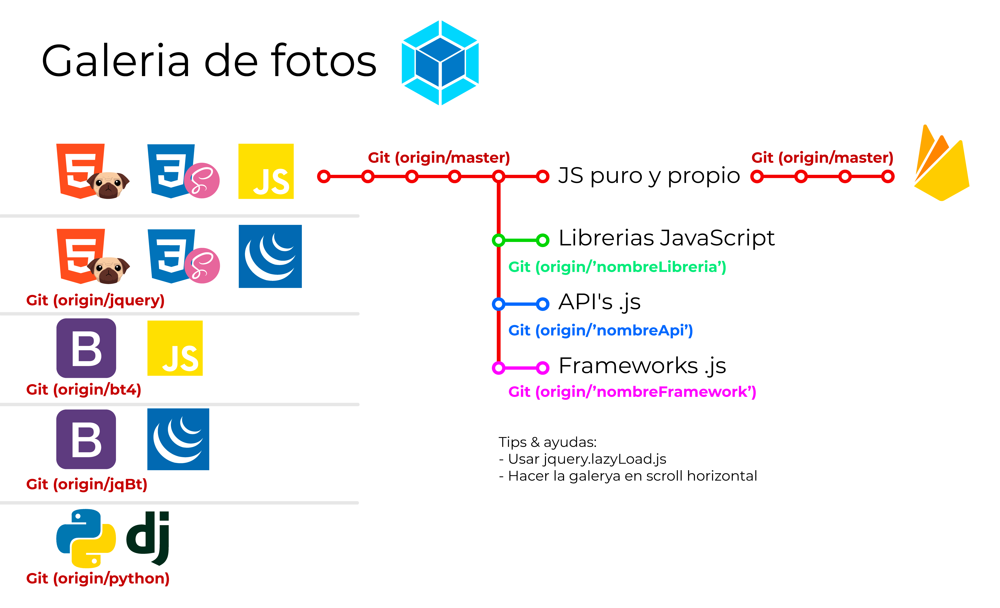

# Lista de cosas que hacer
| Estado | Prioridad | Tarea                                                                                                                |
| ------ | --------- | -------------------------------------------------------------------------------------------------------------------- |
| ❌      | ⭐⭐⭐       | Crear base de datos con FireBase y boton de descarga en PDF del CV (formulario de registro e inicio de sesion).      |
| 🛠     | ⭐⭐⭐       | Crear codigo QR para la descarga en el registro con Firebase                                                         |
| ✅      | ⭐⭐⭐⭐      | Crear las mediaQuerys. (hecho)                                                                                       |
| ❌      | ⭐⭐⭐       | Crear script para cambio de idioma. (iniciado, menu y Informacion personal)                                          |
| 🛠     | ⭐⭐⭐⭐      | Mejorar las variables css e incluir mas colores. (Mejorado un poco junto al darkMode. debe continuarse)              |
| ❌      | ⭐⭐⭐⭐      | Cambiar el README por un porfolio o por el mismo index.html del CV.                                                  |
| ❌      | ⭐⭐        | Crear formulario de contacto (preferible PHP).                                                                       |
| 🛠     | ⭐⭐⭐⭐      | Rehacer menu completo con el fin de mejorar estructura, clases, responsiveQueries y animaciones(&::hover).           |
| ✅      | ⭐⭐⭐⭐      | Dividir el SCSS en varios archivos de elementos hijos del menu princiapl                                             |
| 🛠     | ⭐⭐⭐⭐⭐     | Adicionar en el menu un Sub-menu para las diferentes partes del CV (Exp.labora, estudios, otras comp., habilidades ) |
| 🛠     | ⭐⭐⭐⭐⭐     | Revisar todos los textos del CV y mejorar ortografia y lectura del documento.                                        |
| ✅      | ⭐⭐⭐⭐⭐     | Modificar el boton todo hacia arriba y agregar icono SVG                                                             |

## Opciones de futuro por incluir en el CV
- Hacer carta de presentacion.
- Conseguir carta de recomendaciones.
---
## Tarea para hacer en otros projectos
### Rehacer projectos:
- Custom buttons
- Custom checkbox
- Free icons SVG ✅ 
  
### Projectos nuevos
- Galeria de fotos responsive con ramas Git (iniciado): 
  
- Probar de crear un repositorio para gama de colores (solidos y degradados).
- LandingPage / pagina enfocada a la venta de longboard.